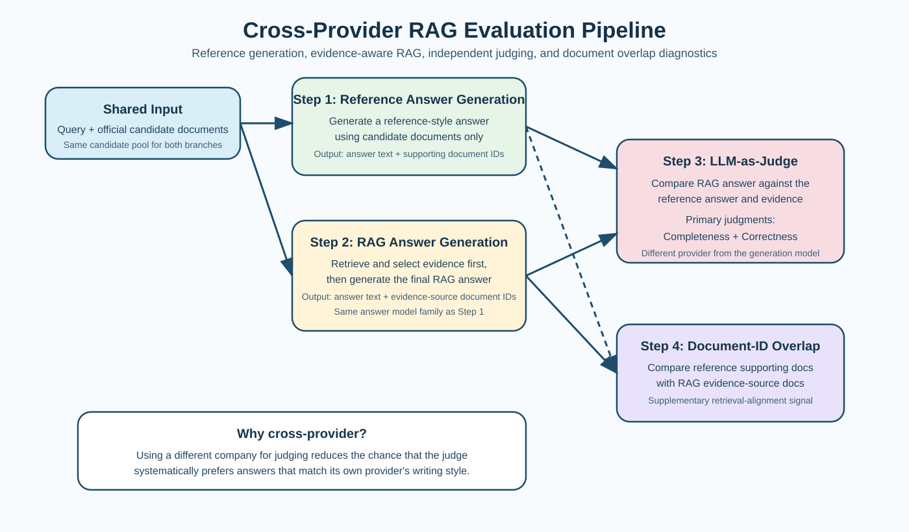

# Cross-Provider Evaluation Pipeline

This document describes the evaluation protocol we use for our LongEval Task 4 RAG experiments. The design combines reference-style answer generation, evidence-aware RAG generation, independent LLM-based judging, and a lightweight document-overlap diagnostic.

## Overview

Our evaluation pipeline has four components:

1. reference answer generation with document-ID attribution;
2. RAG answer generation with evidence-source document-ID attribution;
3. LLM-as-judge scoring for completeness and correctness;
4. document-ID overlap as a supporting retrieval alignment metric.

The key design choice is cross-provider evaluation. The answer-generation model and the judge model come from different companies. This reduces the risk that the judge will systematically prefer answers that resemble its own provider's style, structure, or implicit preferences.

## Step 1: Reference Answer Generation

For each query, we start from the official candidate document set. A generation model is asked to produce a reference-style answer using the candidate documents as the only allowed evidence source.

The output is not just free text. Each reference answer is paired with the document IDs that support it. This gives us a document-grounded pseudo-gold target rather than an untraceable text-only answer.

This step serves two purposes:

- it provides a strong comparison target when no manually written gold answer is available;
- it preserves evidence provenance, which is essential for later overlap analysis.

## Step 2: RAG Answer Generation

The RAG system receives the same query and the same candidate document pool, but it first performs retrieval and evidence selection. The generation model then writes the final answer only from the selected evidence.

Again, the output is tracked at the document level. For every generated answer, we record the document IDs behind the evidence actually used by the system.

This gives us two aligned artifacts for each query:

- the reference answer with its supporting document IDs;
- the RAG answer with its selected evidence document IDs.

## Step 3: LLM-as-Judge

An independent judge model then compares the RAG answer against the reference answer and its supporting evidence.

We focus on two primary judgment dimensions:

- `completeness`: whether the RAG answer covers the main information present in the reference target;
- `correctness`: whether the RAG answer is factually consistent with the available evidence and does not introduce unsupported claims.

The judge is intentionally separated from the generation provider. In other words, the model family that produces answers is not the same model family that grades them. This cross-provider setup helps reduce evaluation bias caused by provider-specific writing style preferences.

## Step 4: Document-ID Overlap

We also compute document-ID overlap between the reference side and the RAG side as a supplementary diagnostic.

The purpose of this metric is not to replace judgment quality scores. Instead, it tells us whether the RAG system is grounding its answer in a document set that is similar to the document set used by the reference answer.

This metric is useful because two answers may look superficially similar while relying on very different evidence. Conversely, a partially incomplete answer may still retrieve the correct core documents. The overlap score therefore helps us interpret whether a quality difference is more likely caused by retrieval, evidence selection, or answer writing.

Depending on the experiment, the overlap can be reported as:

- exact set overlap;
- intersection over union;
- reference coverage by RAG-selected document IDs.

In practice, we mainly use it as a retrieval-side supporting signal rather than as a final quality score.

## Why This Protocol Is Useful

This protocol is designed to separate four questions that are often conflated in RAG evaluation:

1. Did the system retrieve the right documents?
2. Did the system use those documents when generating the answer?
3. Is the answer complete relative to a strong reference target?
4. Is the answer correct and evidence-grounded?

By combining answer text, document provenance, and independent judging, we avoid relying on a single weak proxy.

## Recommended Reading of the Results

We recommend reading the outputs in the following order:

1. judge-based completeness and correctness;
2. document-ID overlap;
3. qualitative inspection of disagreements between the reference and RAG evidence sets.

If the judge score is low and document overlap is also low, the likely problem is retrieval or evidence selection.

If the judge score is low but document overlap is reasonably high, the likely problem is answer synthesis, compression, or citation use rather than retrieval itself.

## Summary

In short, our pipeline evaluates RAG with a cross-provider design:

- one model family generates the reference and RAG answers;
- a different model family acts as the judge;
- document-level provenance is preserved on both sides;
- overlap between reference and RAG document IDs is used as a supporting diagnostic.

This makes the evaluation more robust than text-only comparison and less vulnerable to self-preference effects in LLM-based judging.

## Note on Missing Full Text

Some documents in the dataset do not contain usable `fullText` content. When this happens, the pipeline may need to fall back to `abstract` text in order to preserve coverage for reference generation, retrieval, or judging inputs.

This fallback should be understood as a data-availability constraint rather than a preferred methodological choice. In other words, full text is used whenever available, and abstract fallback is only applied when the underlying document record does not provide usable full-text evidence.
